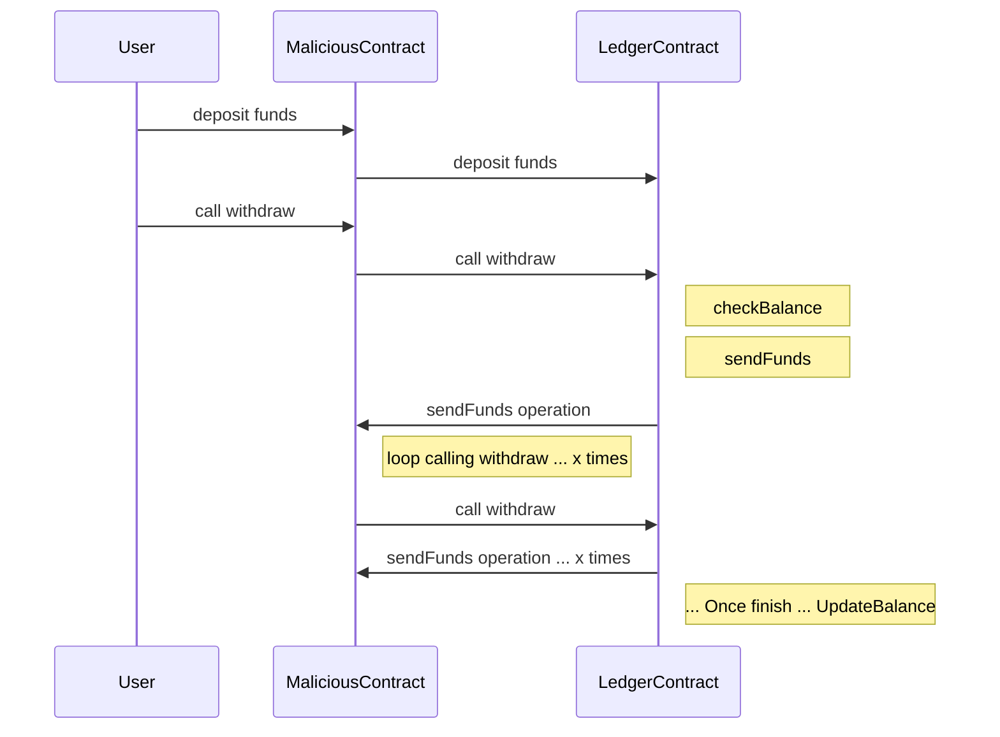
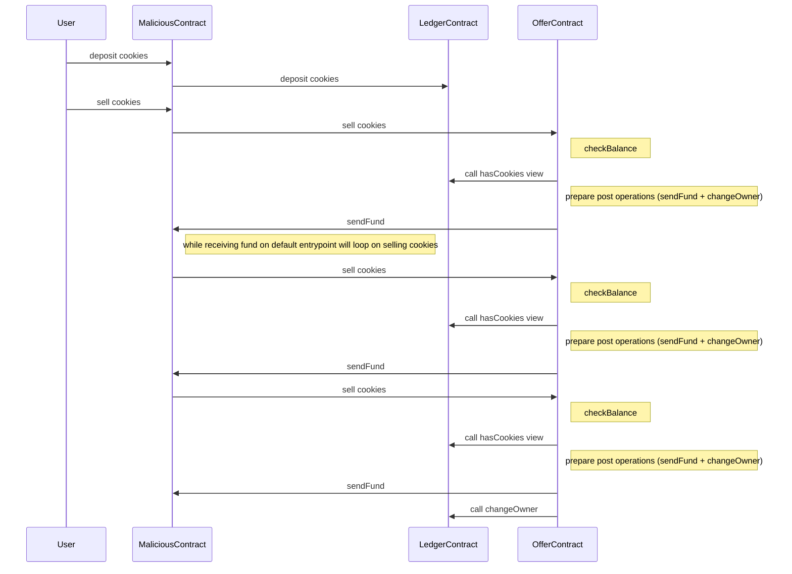

## Leaks

1. Replay attack

A replay attack on a smart contract is a type of security vulnerability that allows an attacker to reuse a validly signed transaction multiple times. We saw on the previous chapter how to do offchain replay attacks, but it is possible to do also onchain replay attacks.
Besides, Tezos prevents this kind of vulnerabilities, it is possible to write a code that does this attack sending the same operation several times for execution.

Compile and simulate the replay attack :

```bash
taq compile 1-replay.jsligo
taq simulate 1-replay.tz --param=1-replay.parameter.parameter.tz
```

The simulation will tell you thatseveral internal transaction will be executed.
But if you deploy the code and try to really execute it :

```bash
taq deploy 1-replay.tz --mutez 1000 -e testing

taq transfer KT1VMt7t4CboRP6jYBUdBQowHb4NR1UtmDrz -e testing
```

Then, the Tezos will detect the flaw

```logs
  "message": "(transaction) proto.017-PtNairob.internal_operation_replay"
```

2. Memory overflow

Memory overflow is a kind of attack that fulfills the memory of a smart contract resulting on making this contract unusable. Even simply loading the data into memory and deserializing it at the beginning of the call, could use so much gas that any call to the contract would fail. All the funds would be forever locked into the contract.

Here are the list of dangerous types to use carefully :

- integers and nats : as they can be increased to an arbitrary large value
- strings : as there is no limit on their lengths
- lists, sets, maps : that can contain an arbitrary number of items

&rarr; **SOLUTION** :

- ask the user to pay a minimum tez for each call
- set a threshold limit
- store data on a big_map
- avoid unnecessary onchain computation that can be done off chain. Ex : do not loop onchain and just update a part of a map

Example with the current on FA1.2 implementation : https://inference.ag/blog/2023-10-09-FA12_spenders/

You can have a look on the Ligo implementation of fa1.2 on the Ligo registry [here](https://packages.ligolang.org/package/ligo-fa1.2)

The code respect the Standard but you can see that the [Allowance type is actually a map](https://github.com/frankhillard/ligoFA12/blob/main/lib/asset/allowance.mligo#L3C8-L3C8). It would have been better to change the Standard and use a `big_map` instead a `map`. If you implement the Standard differently, then your smart contract storage definition and entrypoint signatures will not match anymore and will not be supported by other platforms

3. Reentrancy

These attacks allow an attacker to repeatedly call a contract function in a way that drains the contract’s resources, leading to a denial of service (DoS) attack

One of the most well-known examples of a reentrancy attack occurred in 2016, when an attacker exploited a vulnerability in the DAO (Decentralized Autonomous Organization) contract on the Ethereum blockchain. But this popular hack is still actively used :

- Uniswap/Lendf.Me hacks (April 2020) – $25 mln, attacked by a hacker using a reentrancy.
- The BurgerSwap hack (May 2021) – $7.2 mln, because of a fake token contract and a reentrancy exploit.
- The SURGEBNB hack (August 2021) – $4 mln, seems to be a reentrancy-based price manipulation attack.
- CREAM FINANCE hack (August 2021) – $18.8 mln, reentrancy vulnerability allowed the exploiter for the second borrow.
- Siren protocol hack (September 2021) – $3.5 mln, AMM pools were exploited through reentrancy attack.

This kind of attack is quite simple to put in place with Solidity the way it works.

Consider this scenario :



Why this scenario is not possible on Solidity ?
On Solidity, the operation will call directly the smart contract like doing a stop, call a synchronous execution and continue the flow.

Why this scenario is not possible on Tezos ?
On Tezos, the first transaction will update the state and will execute a list of operation at the end of execution. Next executions will encounter an updated state

Let's implement a more complex scenario, now :



The issue here is clearly that we send money without updating the state first

&rarr; **SOLUTION** :

- Mutex safeguard : The goal is to avoid that multiple internal operations are generated. A boolean `isRunning` will lock only one operation for the full transaction flow.

  1. Check the isRunning is false
  2. Set isRunning to true
  3. Do logic code ...
  4. Create a last operation transaction to reset the boolean to false

- Check-and-send pattern : Principle of separating state changes from external contract interactions. First, update the contract’s state, then interact with other contracts

//TODO code + fix

- Authorize withdraw transfer only to user account : As User wallet cannot do callback loops, it solves the issue but this solution is not always feasible and limitating. To check if an address is implicit, the Tezos.get_sender and the Tezos.get_source are always equal.

- Audit External Contract calls : This is very hard to check, for example on withdraw for a token transfer, any contract can receive funds.

- Call third-party security experts or employ automated security tools : If you are not sure about your code, they will identify weaknesses and validate the contract’s security measures.

4. Overflow

There is no SafeMath in ligo . Do not confuse with https://packages.ligolang.org/package/@ligo/math-lib that is to manipulate float instead or multiply/deivide by 10^6. For the nat, int, and timestamp types, the Michelson interpreter uses arbitrary-precision arithmetic provided by the OCaml Zarith library. It means that their size is only limited by gas or storage limits. You can store huge numbers in a contract without reaching the limit

&rarr; **SOLUTION** : do operation on int or nat instead of tez as it has larger values

5. frontRunning / MEV : It can be done by the baker itself as the list is known in advance at each period ... or any bots litening to the gossip network ...

- buy before big BUY TX , sell token after === sandwich attack
- BOT : whataver increase user balance, you just copy with higher fees to pass first
- BAKER : just change the order
